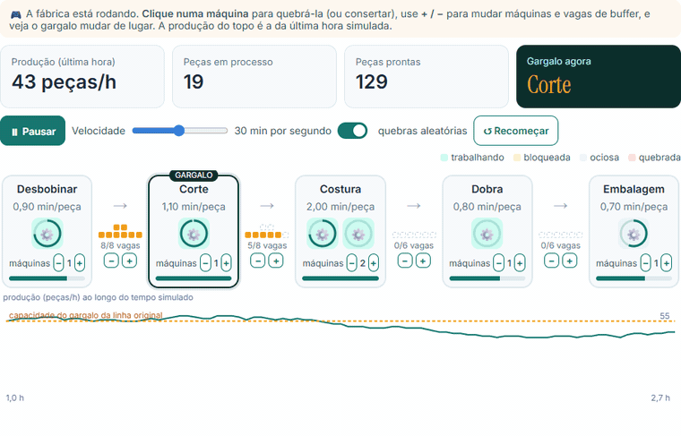

<div align="center">

# Production Line · Digital Twin

**Where does production get stuck, and what do you do about it?**

An interactive dashboard that simulates a production line part by part, with random cycle times,
machine breakdowns and limited buffers between stations. Edit the factory in a table and see what
happens to output, lead time and the bottleneck.

[](https://www.python.org)
[](https://simpy.readthedocs.io)
[](https://streamlit.io)
[](https://plotly.com/python/)
[](tests/)

`Validated against the M/M/1 and M/M/c queueing formulas: 1.5% mean error`

[Português](README.md) &nbsp;·&nbsp; **English**

</div>




> The interface is in Portuguese. Translations of the main terms: *peças/h* = parts/hour,
> *trabalhando / quebrada / bloqueada / ociosa* = working / broken / blocked / idle.

---

## Where it came from

It grew out of my day-to-day at Descartee, where I build the internal production-control systems of a nonwoven disposables plant. The sample line (unwind, cut, sew, fold, pack) follows that process. The simulation and statistics come from my Cyber-Physical Systems Engineering degree at PUC-SP.

## The problem

In a serial line, output is capped by the slowest station, the bottleneck. The back-of-the-envelope
way to find it is capacity = machines × 60 / cycle time × availability. That formula leaves out
three things every shop floor has:

- **cycle times vary** from one part to the next;
- **machines break down** at random moments and stay down for a random time;
- **buffers between stations are finite**, so a machine can finish a part and have nowhere to put
  it (blocked) or run out of parts to work on (starved).

Together they make the line produce less than the bottleneck's capacity, and sometimes they move
the bottleneck. A line like that has no closed-form answer, so the project simulates it.

## The model

```
Raw material → [Unwind] → buffer → [Cut] → buffer → [Sew ×2] → buffer → [Fold] → buffer → [Pack] → Shipping
```

The default line is based on a nonwoven disposables plant. Each station has:

| Parameter | Distribution | Why |
|---|---|---|
| Cycle time | Lognormal (mean and CV) | Always positive with a right tail, like real operation times |
| Time between failures (MTBF) | Exponential | Memoryless failures, constant rate |
| Repair time (MTTR) | Exponential | Mostly short stops, sometimes long ones |
| Input buffer | Fixed capacity | A finished part with no free slot stays on the machine (blocking after service) |

It is a **discrete-event simulation** built with [SimPy](https://simpy.readthedocs.io): each machine
is a process that takes a part from its queue, works on it, breaks down midway if its failure clock
runs out and then tries to hand the part to the next queue. Each replication drops a 4 h warm-up,
and results come with a **95% confidence interval** across replications with different seeds.

**Assumptions:** the first station never runs out of raw material, shipping never blocks the last
station, failures only count during operation, and the parameters are illustrative. In a real plant
they would come from production records.

## What each tab shows

| Tab | Question | Result with the default line |
|---|---|---|
| Brinque (play) | A live animated factory: break machines with a click, change machines and buffers | the bottleneck and output change instantly, in the browser |
| Visão geral (overview) | How much does the line make and where does each machine spend its time? | 49.9 parts/h, 98% of bottleneck capacity; 17.5 min lead time |
| Gargalo e cenários (bottleneck) | If I can buy one machine, where should it go? | **Cut**: +6.5 parts/h; elsewhere the gain is within noise |
| Buffers | How much work-in-process storage is worth it? | output × lead time curve for each buffer size |
| Variabilidade (variability) | What does cycle-time variation cost? | CV from 0 to 1.5 removes 14% of output; with no buffers, 34% |
| Validação (validation) | Does the simulator match where an exact answer exists? | 1.5% mean error against M/M/1, Little's Law checked |

<p align="center">
  
  
</p>

The stacked bar on the overview is how you spot the bottleneck on the floor: stations upstream of
it show up **blocked** (they produce but have nowhere to put the part) and stations downstream show
up **idle** (they wait for parts).

<p align="center">
  
  
</p>

## Validation

A whole line has no exact answer, but special cases do. One station with Poisson arrivals and
exponential service is the M/M/1 queue, with W = 1/(μ − λ); with c machines it is M/M/c, solved
with the Erlang C formula. The automated tests check:

| Test | What it checks |
|---|---|
| `test_mm1_tempo_no_sistema_bate_com_formula` | M/M/1 W and L at ρ = 0.5 and 0.8, 8% tolerance |
| `test_mmc_erlang_c` | M/M/3 W at ρ = 0.8 |
| `test_lei_de_little_na_linha_completa` | L = λW on the 5-station line, with breakdowns and blocking |
| `test_fracoes_de_estado_somam_um` | working + broken + blocked + idle = 100% |
| `test_throughput_nao_passa_do_gargalo` | output ≤ effective capacity of the slowest station |
| `test_deterministica_sem_quebra_atinge_capacidade` | with no randomness, the line hits the bottleneck limit exactly |
| `test_buffer_maior_nao_reduz_producao` | more buffer never lowers output |
| `test_mesma_semente_mesmo_resultado` | reproducibility |

```bash
python -m pytest tests
```

## Running it

```bash
git clone https://github.com/caiogadotti/linha-producao-digital-twin.git
cd linha-producao-digital-twin
pip install -r requirements.txt
streamlit run app.py
```

## Layout

```
app.py                  Streamlit dashboard (six tabs)
brinque.html            Play tab animated factory (JavaScript, runs in the browser)
modelo.py               SimPy simulation, confidence interval, M/M/1 and M/M/c formulas
tests/test_modelo.py    validation against queueing theory and invariants
.streamlit/config.toml  visual theme
docs/                   README images
```

## References

- HOPP, W. J.; SPEARMAN, M. L. *Factory Physics*. 3rd ed. Waveland Press, 2011.
- LAW, A. M. *Simulation Modeling and Analysis*. 5th ed. McGraw-Hill, 2015.
- LITTLE, J. D. C. A proof for the queuing formula L = λW. *Operations Research*, v. 9, n. 3, p. 383-387, 1961.
- GOLDRATT, E. M.; COX, J. *The Goal*. North River Press, 1984.
- KRITZINGER, W. et al. Digital Twin in manufacturing: a categorical literature review and classification. *IFAC-PapersOnLine*, v. 51, n. 11, p. 1016-1022, 2018.

---

Caio Gadotti · Personal project.
