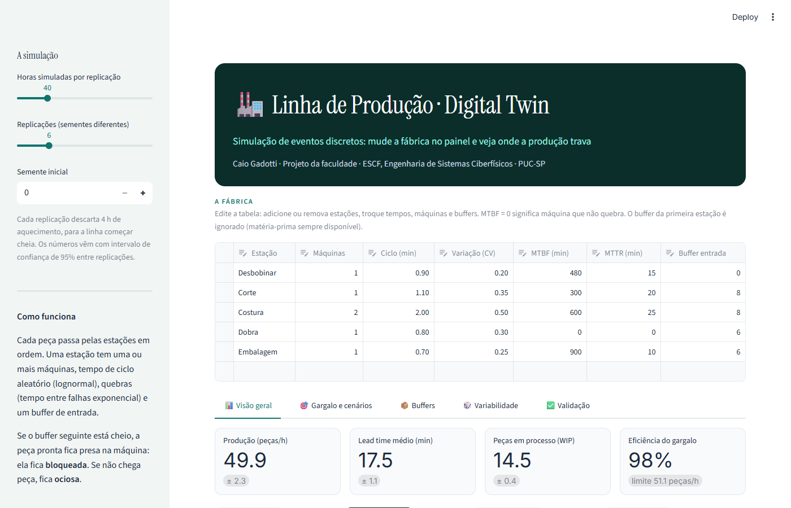
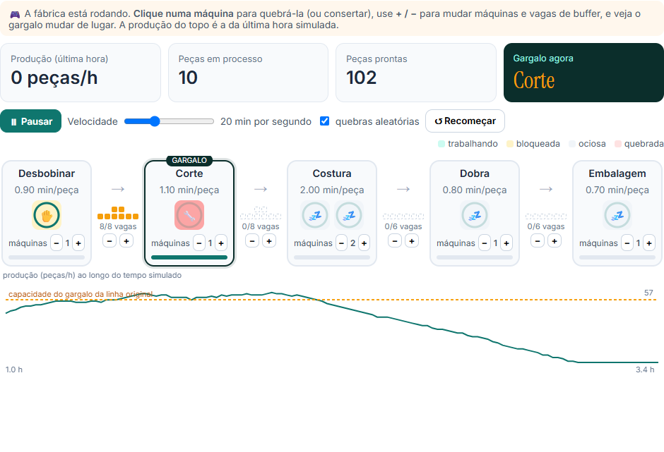
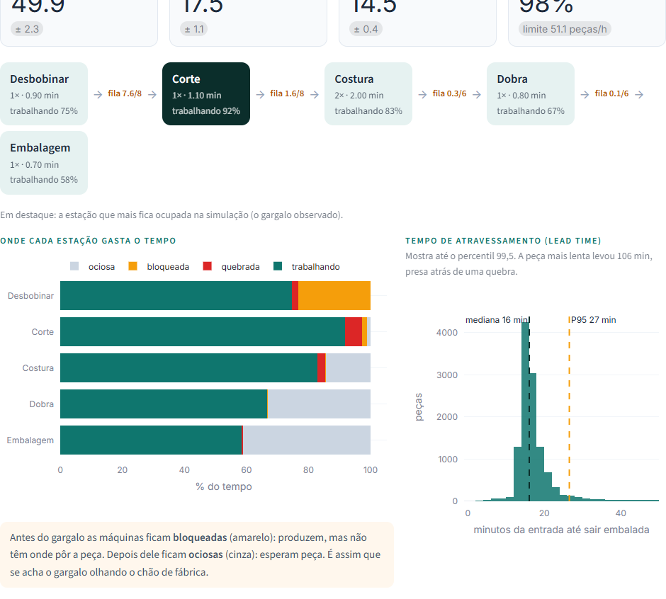
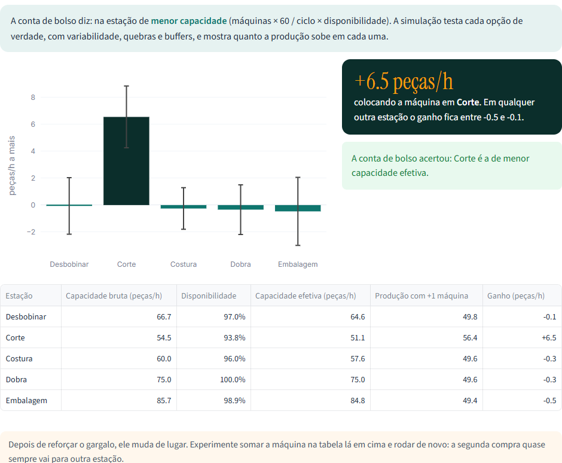
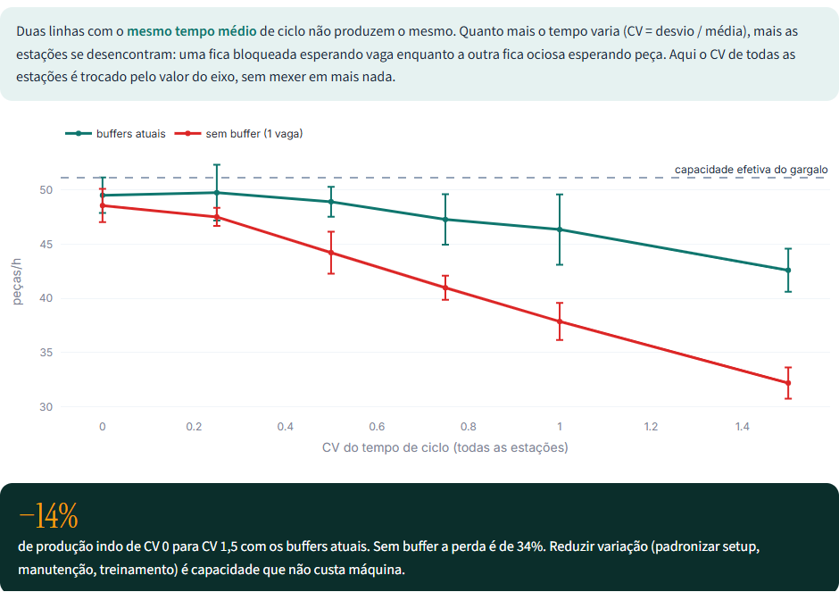
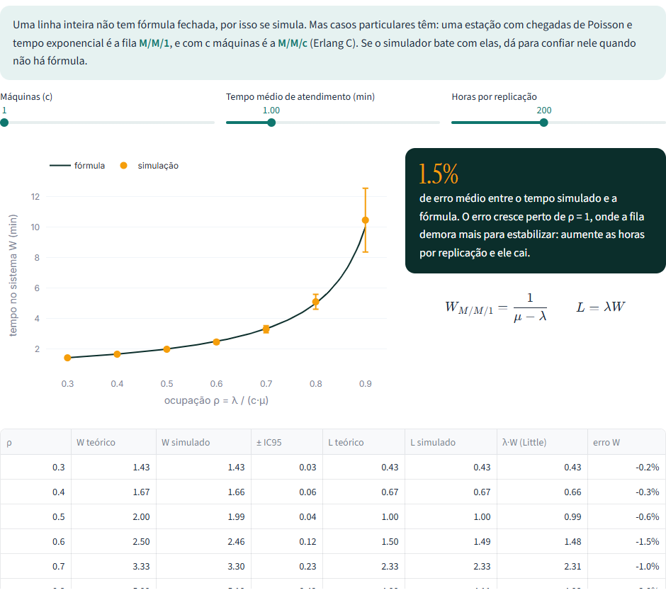

<div align="center">

# Linha de Produção · Digital Twin

**Onde a produção trava, e o que fazer com isso?**

Um painel interativo que simula uma linha de produção peça por peça, com tempos aleatórios,
quebras de máquina e estoques intermediários limitados. Você edita a fábrica numa tabela e vê
o efeito na produção, no tempo de atravessamento e no gargalo.

[](https://www.python.org)
[](https://simpy.readthedocs.io)
[](https://streamlit.io)
[](https://plotly.com/python/)
[](tests/)

`Validado contra as fórmulas das filas M/M/1 e M/M/c: erro médio de 1,5%`

**Português** &nbsp;·&nbsp; [English](README.en.md)

</div>





---

## O problema

Numa linha em série a produção é limitada pela estação mais lenta, o gargalo. A conta de bolso
para achá-lo é simples: capacidade = máquinas × 60 / tempo de ciclo × disponibilidade. Só que ela
ignora três coisas que existem em qualquer chão de fábrica:

- **o tempo de ciclo varia** de uma peça para outra;
- **máquinas quebram** em momentos aleatórios e ficam paradas um tempo aleatório;
- **o estoque entre estações é limitado**, então uma máquina pode terminar a peça e não ter onde
  colocá-la (fica bloqueada) ou ficar sem peça para trabalhar (fica ociosa).

Juntas, elas fazem a linha produzir menos que a capacidade do gargalo e às vezes mudam o gargalo
de lugar. Não existe fórmula fechada para uma linha assim. Por isso o projeto simula.

## O modelo

```
Matéria-prima → [Desbobinar] → buffer → [Corte] → buffer → [Costura ×2] → buffer → [Dobra] → buffer → [Embalagem] → Expedição
```

A linha padrão imita uma confecção de descartáveis em TNT. Cada estação tem:

| Parâmetro | Distribuição | Por quê |
|---|---|---|
| Tempo de ciclo | Lognormal (média e CV) | Sempre positivo e com cauda à direita, como tempo de operação real |
| Tempo entre quebras (MTBF) | Exponencial | Quebra sem memória, taxa constante |
| Tempo de reparo (MTTR) | Exponencial | Parada curta na maioria, longa às vezes |
| Buffer de entrada | Capacidade fixa | Peça pronta sem vaga fica presa na máquina (bloqueio após serviço) |

A simulação é de **eventos discretos** com [SimPy](https://simpy.readthedocs.io): cada máquina é um
processo que pega peça da fila, trabalha, quebra no meio se for o caso e tenta entregar para a fila
seguinte. Cada replicação descarta 4 h de aquecimento, e os resultados vêm com **intervalo de
confiança de 95%** entre replicações com sementes diferentes.

**Hipóteses:** matéria-prima nunca falta na primeira estação, a expedição nunca trava a última,
quebras contam só durante a operação e os parâmetros são ilustrativos. Numa fábrica real viriam
do apontamento de produção.

## O que cada aba mostra

| Aba | Pergunta | Resultado com a linha padrão |
|---|---|---|
| Brinque | A fábrica animada ao vivo: quebrar máquinas com um clique, mudar máquinas e buffers | o gargalo e a produção mudam na hora, no navegador |
| Visão geral | Quanto a linha produz e onde cada máquina gasta o tempo? | 49,9 peças/h, 98% da capacidade do gargalo; lead time de 17,5 min |
| Gargalo e cenários | Se eu comprar uma máquina, onde coloco? | no **Corte**: +6,5 peças/h; nas outras o ganho fica dentro do ruído |
| Buffers | Quantas vagas de estoque intermediário valem a pena? | curva produção × lead time para cada tamanho de buffer |
| Variabilidade | Quanto a variação do tempo custa? | CV de 0 para 1,5 tira 14% da produção; sem buffer, 34% |
| Validação | O simulador acerta onde existe resposta exata? | erro médio de 1,5% contra M/M/1, Lei de Little conferida |

<p align="center">
  
  
</p>

A barra empilhada da visão geral é o jeito de achar o gargalo olhando a fábrica: as estações antes
dele aparecem **bloqueadas** (produzem, mas não têm onde pôr a peça) e as depois dele aparecem
**ociosas** (esperam peça).

<p align="center">
  
  
</p>

## Validação

Uma linha inteira não tem resposta exata, mas casos particulares têm. Uma estação com chegadas
de Poisson e tempo exponencial é a fila M/M/1, com W = 1/(μ − λ); com c máquinas é a M/M/c, pela
fórmula de Erlang C. Os testes automáticos conferem:

| Teste | O que verifica |
|---|---|
| `test_mm1_tempo_no_sistema_bate_com_formula` | W e L da M/M/1 em ρ = 0,5 e 0,8, tolerância de 8% |
| `test_mmc_erlang_c` | W da M/M/3 em ρ = 0,8 |
| `test_lei_de_little_na_linha_completa` | L = λW na linha de 5 estações, com quebras e bloqueio |
| `test_fracoes_de_estado_somam_um` | trabalhando + quebrada + bloqueada + ociosa = 100% |
| `test_throughput_nao_passa_do_gargalo` | produção ≤ capacidade efetiva da estação mais lenta |
| `test_deterministica_sem_quebra_atinge_capacidade` | sem aleatoriedade, a linha produz exatamente o limite do gargalo |
| `test_buffer_maior_nao_reduz_producao` | mais buffer nunca piora a produção |
| `test_mesma_semente_mesmo_resultado` | reprodutibilidade |

```bash
python -m pytest tests
```

## Como rodar

```bash
git clone https://github.com/caiogadotti/linha-producao-digital-twin.git
cd linha-producao-digital-twin
pip install -r requirements.txt
streamlit run app.py
```

## Estrutura

```
app.py                  painel Streamlit (seis abas)
brinque.html            fábrica animada da aba Brinque (JavaScript, roda no navegador)
modelo.py               simulação SimPy, intervalo de confiança, fórmulas M/M/1 e M/M/c
tests/test_modelo.py    validação contra teoria de filas e invariantes
.streamlit/config.toml  tema visual
docs/                   imagens do README
```

## Referências

- HOPP, W. J.; SPEARMAN, M. L. *Factory Physics*. 3. ed. Waveland Press, 2011.
- LAW, A. M. *Simulation Modeling and Analysis*. 5. ed. McGraw-Hill, 2015.
- LITTLE, J. D. C. A proof for the queuing formula L = λW. *Operations Research*, v. 9, n. 3, p. 383-387, 1961.
- GOLDRATT, E. M.; COX, J. *A Meta*. Nobel, 2002.
- KRITZINGER, W. et al. Digital Twin in manufacturing: a categorical literature review and classification. *IFAC-PapersOnLine*, v. 51, n. 11, p. 1016-1022, 2018.

---

Caio Gadotti · Projeto pessoal.
